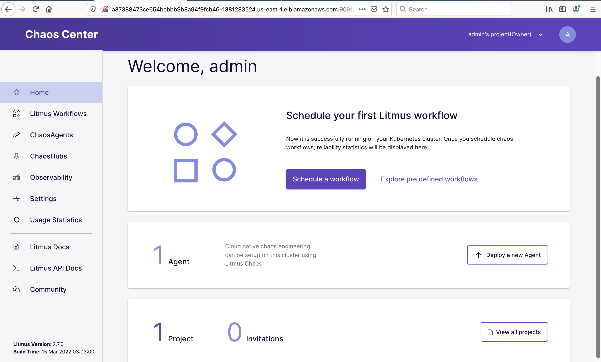

# Chaos-Engineering-with-LitmusChaos-on-Amazon-EKS1
project 5

##
---


According to Principles of Chaos Engineering, “Chaos Engineering is the discipline of experimenting on a system in order to build confidence in the system’s capability to withstand turbulent conditions in production.” Chaos Engineering takes a deliberate approach of injecting failure in a controlled environment using well-planned experiments and helps engineers find weaknesses in systems before they become an outage.

Many companies such as Facebook, Linkedin and Netflix to name a few, practice Chaos Engineering to better understand their distributed systems and microservice architecture. 

Organizations are embracing microservices-based architectures by refactoring large monolith applications into smaller, independent, and loosely coupled services. These independent services are faster to deploy and scale, enabling organizations to innovate and deliver faster.

However, as the application grows, these microservices present their own challenges. For example, as you deploy tens or hundreds or thousands of microservices, operational tasks such as distributed tracing, debugging, testing, dependency mapping, and so on, become challenging. A failure as a result of network latency, disk failure, server failure, downstream service error, and so on in a microservices-based architecture could render an application unusable.

Despite this, testing for system-level failure scenarios is often unaccounted for and hard for some organizations to make it part of their software development life cycle. To address these challenges, organizations are increasingly practicing Chaos Engineering to test the reliability and performance of distributed systems.

### LitmusChaos Architecture

[LitmusChaos](https://litmuschaos.io/) is a cloud-native Chaos Engineering framework for Kubernetes. It is built using the [Kubernetes Operator framework](https://sdk.operatorframework.io/). A [Kubernetes Operator](https://kubernetes.io/docs/concepts/extend-kubernetes/operator/) is a software extension to Kubernetes that makes use of [custom resource definitions (CRDs)](https://kubernetes.io/docs/concepts/extend-kubernetes/api-extension/custom-resources/) to manage applications and their components.

The Litmus Chaos Operator helps reconcile the state of ChaosEngine, a custom resource that holds the chaos intent specified by a developer or DevOps engineer against a particular stateless/stateful Kubernetes deployment. The operator performs specific actions upon creation of the ChaosEngine, its primary resource. The operator also defines a secondary resource (the engine runner pod), which is created and managed by it in order to implement the reconcile functions.

### Objective:

By the end of this project, you will be able to create an Amazon EKS cluster with managed nodes; install LitmusChaos and a demo application; and install chaos experiments to be run on the demo application and observe the behavior.

### Create EKS cluster

You will need the following to complete the project:

- [AWS CLI version 2](https://docs.aws.amazon.com/cli/latest/userguide/install-cliv2.html)
- [eksctl](https://docs.aws.amazon.com/eks/latest/userguide/eksctl.html)
- [kubectl](https://docs.aws.amazon.com/eks/latest/userguide/install-kubectl.html)
- [Helm](https://www.eksworkshop.com/beginner/060_helm/helm_intro/install/index.html)

Create a new EKS cluster using eksctl:
1. Open your terminal and run these commands on it
    
    ```bash
    export ACCOUNT_ID=$(aws sts get-caller-identity --output text --query Account)
    export AWS_REGION=us-east-2 #change as per your region of choice
    ```
    
2. Create a file on your PC using this command

```bash
touch cluster.yaml
```

1. Edit the **cluster.yaml** file and place these codes in it , after that save and exit


1. Run the below command on the terminal to create the cluster

```bash
eksctl create cluster -f cluster.yaml
```


### Install Helm

```bash
curl -sSL https://raw.githubusercontent.com/helm/helm/master/scripts/get-helm-3 | bash
```

Verify Helm installation using the command below and confirm that you are using Helm version v3.X:

```bash
helm version --short
```
### Install LitmusChaos

Let’s install LitmusChaos on an Amazon EKS cluster using a Helm chart. The Helm chart will install the needed CRDs, service account configuration, and ChaosCenter.

Add the Litmus Helm repository using the command below:

```bash
helm repo add litmuschaos https://litmuschaos.github.io/litmus-helm/
```

Confirm that you have the Litmus-related Helm charts:

```bash
helm search repo litmuschaos
```

The output should look like below:


Create a namespace to install LitmusChaos.

```bash
kubectl create ns litmus
```

By default, Litmus Helm chart creates NodePort services. Let’s change the backend service type to ClusterIP and front-end service type to LoadBalancer, so we can access the Litmus ChaosCenter using a load balancer.

1. Create a file on your PC and name it **override-litmus.yaml**
2. Edit the **override-litmus.yaml file** and place the below code in it. 

```bash
portal:
  server:
    service:
      type: ClusterIP
  frontend:
    service:
      type: LoadBalancer
```

c.  Install the chaos via by running the below command:
```bash
helm install chaos litmuschaos/litmus --namespace=litmus -f override-litmus.yaml
```


Verify that LitmusChaos is running:

```bash
kubectl get pods -n litmus
```


```bash
kubectl get svc -n litmus
```


```bash
export LITMUS_FRONTEND_SERVICE=`kubectl get svc chaos-litmus-frontend-service -n litmus --output jsonpath='{.status.loadBalancer.ingress[0].hostname}:{.spec.ports[0].port}'`echo "Litmus ChaosCenter is available at http://$LITMUS_FRONTEND_SERVICE"
```

The output should look like below:

```bash
➜ echo "Litmus ChaosCenter is available at http://$LITMUS_FRONTEND_SERVICE"
Litmus ChaosCenter is available at http://xxxxxxxxxxxxxx-xxxxxx7948.us-east-1.elb.amazonaws.com:9091
```


Access Litmus ChaosCenter UI using the URL given above and sign in using the default username “admin” and password “litmus.”


After successful sign-in, you should see the welcome dashboard. Click on the ChaosAgents link from the left-hand navigation.



A ChaosAgent represents the target cluster where Chaos would be injected via Litmus. Confirm that Self-Agent is in Active status. Note: It may take a couple of minutes for the Self-Agent to become active.

Confirm the agent installation by running the command below.

```bash
kubectl get pods -n litmus
```

Verify that LitmusChaos CRDs are created:

```bash
kubectl get crds | grep chaos
```

You should see a response similar to the one below showing chaosengines, chaosexperiments, and chaosresults.


Now that we installed LitmusChaos on the EKS cluster, let’s install a demo application to perform some chaos experiments on.

### Install demo application

Let’s deploy nginx on our cluster using the manifest below to run our chaos experiments on it. Save the manifest as nginx.yaml and apply it.

a. Create a file on your PC and name it **nginx.yaml** 

```bash
cat <<EOF > nginx.yaml
```
b. Edit **nginx.yaml** with the below code

```bash
apiVersion: apps/v1
kind: Deployment
metadata:
  name: nginx
  labels:
    app: nginx
spec:
  replicas: 1
  selector:
    matchLabels:
      app: nginx
  template:
    metadata:
      labels:
        app: nginx
    spec:
      containers:
      - image: nginx
        name: nginx
        resources:
          limits:
            cpu: 500m
            memory: 512Mi
          requests:
            cpu: 500m
            memory: 512Mi
```
c. Install the demo app by running the below command on your terminal:

```bash
kubectl apply -f nginx.yaml
```
Verify if the nginx pod is running by executing the command below.

```bash
kubectl get pods
```


### Chaos Experiments

[Litmus ChaosHub](https://hub.litmuschaos.io/) is a public repository where LitmusChaos community members publish their chaos experiments such as **pod-delete,** **node-drain**, **node-cpu-hog**, etc. In this demo walkthrough, we will perform the **pod-autoscaler** experiment from LitmusChaos hub to test cluster auto scaling on Amazon EKS cluster.

### Experiment: Pod Autoscaler

The intent of the pod auto scaler experiment is to check the ability of nodes to accommodate the number of replicas for a deployment. Additionally, the experiment can also be used to check the cluster auto-scaling feature.

**Hypothesis**: Amazon EKS cluster should auto scale when cluster capacity is insufficient to run the pods.

Chaos experiment can be launched using the Litmus ChaosCenter UI by creating a workflow. Navigate to Litmus Chaos Center and select **Litmus Workflows** in the left-hand navigation and then select the **Schedule a workflow** button to create a workflow.


Select the Self-Agent radio button on the Schedule a new Litmus workflow page and select Next.


Choose Create a new workflow using the experiments from ChaosHubs and leave the Litmus ChaosHub selected from the dropdown.


Enter a name for your workflow on the next screen.

Let’s add the experiments in the next step. Select Add a new experiment; then search for autoscaler and select the generic/pod-autoscaler radio button.


Let’s edit the experiment and change some parameters. Choose the Edit icon:

Accept the default values in the General, Target Application, and Define the steady state for this application sections. In the Tune Experiment section, set the TOTAL_CHAOS_DURATION to 180 and REPLICA_COUNT to 10. TOTAL_CHAOS_DURATION sets the desired chaos duration in seconds and REPLICA_COUNT is the number of replicas to scale during the experiment. Select Finish.


Then, choose Next and accept the defaults for reliability score and schedule the experiment to run now. Finally, select Finish to run the chaos experiment.


The chaos experiment is now scheduled to run and you can look at the status by clicking on the workflow.


From the ChaosResults, you will see that the experiment failed because there was no capacity in the cluster to run 10 replicas.


### Install Cluster Autoscaler

Cluster Autoscaler for AWS provides integration with Auto Scaling groups. Cluster Autoscaler will attempt to determine the CPU, memory, and GPU resources provided by an Auto Scaling group based on the instance type specified in its launch configuration or launch template.

Create an IAM OIDC identity provider for your cluster with the following command.

```bash
eksctl utils associate-iam-oidc-provider --cluster eks-litmus-demo --approve
```

### Create an IAM policy and role

Create an IAM policy that grants the permissions that the Cluster Autoscaler requires to use an IAM role.

```bash

{
    "Version": "2012-10-17",
    "Statement": [
        {
            "Action": [
                "autoscaling:DescribeAutoScalingGroups",
                "autoscaling:DescribeAutoScalingInstances",
                "autoscaling:DescribeLaunchConfigurations",
                "autoscaling:DescribeTags",
                "autoscaling:SetDesiredCapacity",
                "autoscaling:TerminateInstanceInAutoScalingGroup",
                "ec2:DescribeLaunchTemplateVersions"
            ],
            "Resource": "*",
            "Effect": "Allow"
        }
    ]
}
```


```bash
aws iam create-policy \
```
```bash
 --policy-name AmazonEKSClusterAutoscalerPolicy \
 --policy-document file://cluster-autoscaler-policy.json
 ```
 

 


Create an IAM role and attach an IAM policy to it using eksctl.

```bash
eksctl create iamserviceaccount \
    --cluster=eks-litmus-demo \
    --namespace=kube-system \
    --name=cluster-autoscaler \
    --attach-policy-arn="arn:aws:iam::576516118645:policy/AmazonEKSClusterAutoscalerPolicy" \
    --override-existing-serviceaccounts \
    --approve
```

Make sure your service account with the ARN of the IAM role is annotated.

```bash
kubectl describe sa cluster-autoscaler -n kube-system
```

### Deploy the Cluster Autoscaler

Download the Cluster Autoscaler manifest.

```bash
curl -o cluster-autoscaler-autodiscover.yaml https://raw.githubusercontent.com/kubernetes/autoscaler/master/cluster-autoscaler/cloudprovider/aws/examples/cluster-autoscaler-autodiscover.yaml
```


Edit the downloaded file to replace <YOUR CLUSTER NAME> with the cluster name (eks-litmus-demo) and add the following two lines.

```bash
- --balance-similar-node-groups
- --skip-nodes-with-system-pods=false
```

The edited section should look like the following:


Apply the manifest file to the cluster.

```bash
kubectl apply -f cluster-autoscaler-autodiscover.yaml
```

Patch the deployment to add the `cluster-autoscaler.kubernetes.io/safe-to-evict` annotation to the Cluster Autoscaler pods with the following command.

```bash
kubectl patch deployment cluster-autoscaler \
-n kube-system \
-p '{"spec":{"template":{"metadata":{"annotations":{"cluster-autoscaler.kubernetes.io/safe-to-evict": "false"}}}}}'
```


Find the latest Cluster Autoscaler version that matches the Kubernetes major and minor versions of your cluster. For example, if the Kubernetes version of your cluster is 1.21, find the latest Cluster Autoscaler release that begins with 1.21. Record the semantic version number (1.21.n) for that release to use in the next step.


```bash
export K8S_VERSION=$(kubectl version --short | grep 'Server Version:' | sed 's/[^0-9.]*\([0-9.]*\).*/\1/' | cut -d. -f1,2)export AUTOSCALER_VERSION=$(curl -s "https://api.github.com/repos/kubernetes/autoscaler/releases" | grep '"tag_name":' | grep -m1 ${K8S_VERSION} | sed 's/[^0-9.]*\([0-9.]*\).*/\1/')
```

Set the Cluster Autoscaler image tag to the version that was exported in the previous step with the following command.

```bash
kubectl set image deployment cluster-autoscaler \
-n kube-system \
cluster-autoscaler=k8s.gcr.io/autoscaling/cluster-autoscaler:${AUTOSCALER_VERSION}
```

After you have deployed the Cluster Autoscaler, you can view the logs and verify that it’s monitoring your cluster load.

View your Cluster Autoscaler logs with the following command.

```bash
kubectl -n kube-system logs -f deployment.apps/cluster-autoscaler
```

Now that we have deployed the Cluster Autoscaler, let’s rerun the same experiment by navigating to Litmus Workflows, then the Schedules tab. Select the three dots menu icon for the workflow and select **Rerun Schedule**.


This time, the Cluster Autoscaler will add additional nodes to the cluster, and the experiment will pass, which proves our hypothesis.


### Experiment Conclusion

Autoscaling the pod triggered the ClusterAautoscaler as a result of insufficient capacity, and a new node was added to the cluster, and the pods were successfully provisioned.

### Next steps

From the above walkthrough, we saw how to get started with Chaos Engineering using LitmusChaos on Amazon EKS cluster. There are additional experiments such as **pod-delete**, **node-drain**, **node-cpu-hog**, and so on that you can integrate with a CI/CD pipeline to perform Chaos Engineering. LitmusChaos also supports **gitops** and advanced chaos workflows using **Chaos Workflows**.

## pod-delete

Pod delete contains chaos to disrupt state of kubernetes resources. Experiments can inject random pod delete failures against specified application.

- Causes (forced/graceful) pod failure of random replicas of an application deployment.
- Tests deployment sanity (replica availability & uninterrupted service) and recovery workflows of the application pod.

**PRE-REQUISITE:**

**Install Litmus Operator**: a tool for injecting Chaos Experiments

## Installation[](https://docs.litmuschaos.io/docs/getting-started/installation/#installation)

Users looking to use Litmus for the first time have two options available to them today. One way is to use a hosted Litmus service like [ChaosNative Litmus Cloud](https://cloud.chaosnative.com/). Alternatively, users looking for some more flexibility can install Litmus into their own Kubernetes cluster.

Users choosing the self-hosted option can refer to our Install and Configure docs for installing alternate versions and more detailed instructions.

- Self-Hosted
- Hosted (Beta)

Installation of Self-Hosted Litmus can be done using either of the below 

**methods** :

[Helm3](https://docs.litmuschaos.io/docs/getting-started/installation/#install-litmus-using-helm) chart 

[Kubectl](https://docs.litmuschaos.io/docs/getting-started/installation/#install-litmus-using-kubectl) yaml spec file. 

Refer to the below details for Self-Hosted Litmus installation.

### Install Litmus using Helm[](https://docs.litmuschaos.io/docs/getting-started/installation/#install-litmus-using-helm)

The helm chart will install all the required service account configuration and ChaosCenter.

The following steps will help you install Litmus ChaosCenter via helm.

### Add the litmus helm repository[](https://docs.litmuschaos.io/docs/getting-started/installation/#step-1-add-the-litmus-helm-repository)


```bash
helm repo add litmuschaos https://litmuschaos.github.io/litmus-helm/helm repo list
```

### Create the namespace on which you want to install Litmus ChaosCenter[](https://docs.litmuschaos.io/docs/getting-started/installation/#step-2-create-the-namespace-on-which-you-want-to-install-litmus-chaoscenter)

- The ChaosCenter can be placed in any namespace, but for this scenario we are choose `litmus` as the namespace.

```bash
kubectl create ns litmus
```

### Install Litmus ChaosCenter[](https://docs.litmuschaos.io/docs/getting-started/installation/#step-3-install-litmus-chaoscenter)

```bash
helm install chaos litmuschaos/litmus --namespace=litmus
```

**Expected Output**

```bash
NAME: chaosLAST DEPLOYED: Tue Jun 15 19:20:09 2021NAMESPACE: litmusSTATUS: deployedREVISION: 1TEST SUITE: NoneNOTES:Thank you for installing litmus 😀Your release is named chaos and its installed to namespace: litmus.Visit https://docs.litmuschaos.io to find more info.
```

> **Note**: Litmus uses Kubernetes CRDs to define chaos intent. Helm3 handles CRDs better than Helm2. Before you start running a chaos experiment, verify if Litmus is installed correctly.
> 

### **Install Litmus using kubectl**[](https://docs.litmuschaos.io/docs/getting-started/installation/#install-litmus-using-kubectl)

### **Install Litmus ChaosCenter**[](https://docs.litmuschaos.io/docs/getting-started/installation/#install-litmus-chaoscenter)

Applying the manifest file will install all the required service account configuration and ChaosCenter.

`kubectl apply -f https://litmuschaos.github.io/litmus/2.6.0/litmus-2.6.0.yaml`


---

## **Verify your installation**[](https://docs.litmuschaos.io/docs/getting-started/installation/#verify-your-installation)

### **Verify if the frontend, server, and database pods are running**[](https://docs.litmuschaos.io/docs/getting-started/installation/#verify-if-the-frontend-server-and-database-pods-are-running)

- Check the pods in the namespace where you installed Litmus:
    
    **Expected Output**
    
    ```bash
    kubectl get pods -n litmus
    ```
    

    
    
    
- Check the services running in the namespace where you installed Litmus:
    
    **Expected Output**
   ```bash 
    kubectl get svc -n litmus
    ```
    
    

    
    
    

---


**Install this Chaos Experiment**

You can install the Chaos Experiment using the following command:
```bash
kubectl apply -f https://hub.litmuschaos.io/api/chaos/2.6.0?file=charts/generic/pod-delete/experiment.yaml
```


**Setup Service Account (RBAC)**

Create a service account using the following command:
```bash
kubectl apply -f https://hub.litmuschaos.io/api/chaos/2.6.0?file=charts/generic/pod-delete/rbac.yaml
```
**Sample Chaos Engine**

Create a file and name it **engine.yaml**

```bash
sudo nano engine.yaml
```

Place the below code in the **engine.yaml** file

```bash
apiVersion: litmuschaos.io/v1alpha1
kind: ChaosEngine
metadata:
  name: nginx-chaos
  namespace: default
spec:
  appinfo:
    appns: 'default'
    applabel: 'app=nginx'
    appkind: 'deployment'
  # It can be active/stop
  engineState: 'active'
  chaosServiceAccount: pod-delete-sa
  experiments:
    - name: pod-delete
      spec:
        components:
          env:
            # set chaos duration (in sec) as desired
            - name: TOTAL_CHAOS_DURATION
              value: '30'

            # set chaos interval (in sec) as desired
            - name: CHAOS_INTERVAL
              value: '10'
              
            # pod failures without '--force' & default terminationGracePeriodSeconds
            - name: FORCE
              value: 'false'

             ## percentage of total pods to target
            - name: PODS_AFFECTED_PERC
              value: ''
```


Once you download the yaml, you can apply the yaml using the below command:
```bash
kubectl apply -f engine.yaml
```
### Node-drain

Drain the node where application pod is scheduled


**PRE-REQUISITE:**

**Install Litmus Operator**: a tool for injecting Chaos Experiments

**Install this Chaos Experiment**

You can install the Chaos Experiment using the following command:
```bash
kubectl apply -f https://hub.litmuschaos.io/api/chaos/2.6.0?file=charts/generic/node-drain/experiment.yaml
```


**Setup Service Account (RBAC)**

Create a service account using the following command:
```bash
kubectl apply -f https://hub.litmuschaos.io/api/chaos/2.6.0?file=charts/generic/node-drain/rbac.yaml
```


Create a file and name it generic**.yaml**
```bash
sudo nano generic.yaml
```
Place the below code in the generic**.yaml** file
```bash
apiVersion: litmuschaos.io/v1alpha1
kind: ChaosEngine
metadata:
  name: nginx-chaos
  namespace: default
spec:
  # It can be active/stop
  engineState: 'active'
  #ex. values: ns1:name=percona,ns2:run=nginx 
  auxiliaryAppInfo: ''
  chaosServiceAccount: node-drain-sa
  experiments:
    - name: node-drain
      spec:
        components:
        # nodeSelector: 
        #   # provide the node labels
        #   kubernetes.io/hostname: 'node02'        
          env:
            - name: TOTAL_CHAOS_DURATION
              value: '60'
              
            # enter the target node name
            - name: TARGET_NODE
              value: ''
```
Once you download the yaml, you can apply the yaml using the below command:
```bash
kubectl apply -f generic.yaml
```


# **node-cpu-hog**

Node CPU hog contains chaos to disrupt the state of Kubernetes resources.

Node CPU hog contains chaos to disrupt the state of Kubernetes resources. Experiments can inject a CPU spike on a node where the application pod is scheduled.

- CPU hog on a particular node where the application deployment is available.
- After test, the recovery should be manual for the application pod and node in case they are not in an appropriate state.

**PRE-REQUISITE:**

**Install Litmus Operator**: a tool for injecting Chaos Experiments

**Install this Chaos Experiment**

You can install the Chaos Experiment using the following command:
```bash
kubectl apply -f https://hub.litmuschaos.io/api/chaos/2.6.0?file=charts/generic/node-cpu-hog/experiment.yaml
```


**Setup Service Account (RBAC)**

Create a service account using the following command

```bash
kubectl apply -f https://hub.litmuschaos.io/api/chaos/2.6.0?file=charts/generic/node-cpu-hog/rbac.yaml
```


Create a file and name it node-cpu.**yaml**
```bash
sudo nano node-cpu.yaml
```

Place the below code in the node-cpu.**yaml** file
```bash
apiVersion: litmuschaos.io/v1alpha1
kind: ChaosEngine
metadata:
  name: nginx-chaos
  namespace: default
spec:
  # It can be active/stop
  engineState: 'active'
  #ex. values: ns1:name=percona,ns2:run=nginx 
  auxiliaryAppInfo: ''
  chaosServiceAccount: node-cpu-hog-sa
  experiments:
    - name: node-cpu-hog
      spec:
        components:
          env:
            # set chaos duration (in sec) as desired
            - name: TOTAL_CHAOS_DURATION
              value: '60'
            
            - name: NODE_CPU_CORE
              value: ''
            
            ## percentage of total nodes to target
            - name: NODES_AFFECTED_PERC
              value: ''

            # provide the comma separated target node names
            - name: TARGET_NODES
              value: ''
```


Once you download the yaml you can apply the yaml using the below command

```bash
kubectl apply -f node-cpu.yaml
```


